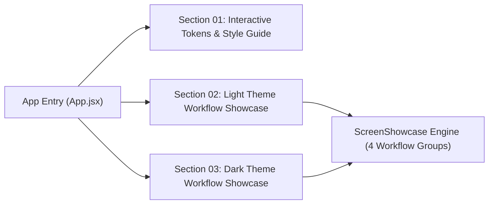
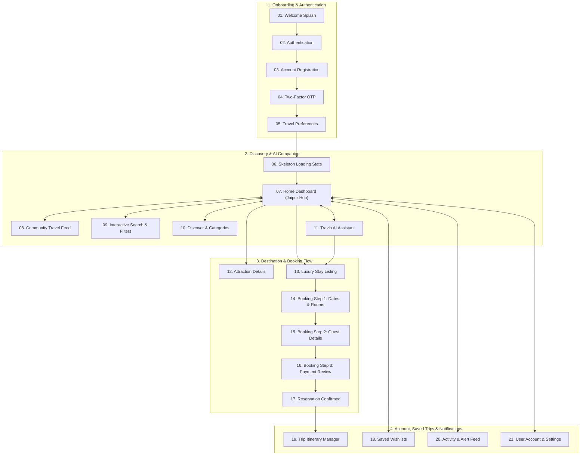

# Travio: AI-Powered Travel Companion & UI Showcase
**Comprehensive Architecture, Design System, & User Journey Summary**

---

## 1. Executive Summary & Core Value Proposition

**Travio** is an AI-driven travel suggestion and itinerary companion application designed to deliver tailored travel recommendations, real-time local exploration, and seamless reservation workflows. Built with modern React and Vite, this repository serves as both a high-fidelity **style guide** and a comprehensive **application flow prototype** featuring 21 interconnected mobile screen mockups across both Light and Dark modes.

### Key Value Pillars
1. **AI-Driven Personalization**: The core value proposition centers around conversational interactions with **Travio AI**, helping users discover optimal flight options, bespoke itineraries, and curated activities based on explicit traveler preferences.
2. **Location-Aware Hub (Jaipur Prototype)**: Instant location fetching immediately configures the user's dashboard with nearby historical monuments, luxury hotel stays, regional dining spots, and bookable local experiences.
3. **End-to-End Booking UX**: A low-friction, 3-step luxury accommodation checkout experience designed for conversion efficiency and user trust.
4. **State-of-the-Art Design Ergonomics**: A curated **Sage Green Token System** coupled with sleek floating scrollbars and glassmorphic micro-interactions that deliver a premium, magazine-like tactile experience.

---

## 2. Design System: The Sage Green Token System

The styling framework is codified in [global.css](file:///c:/Users/admin/Desktop/Personal/Travio-style/src/global.css) and demonstrated dynamically in [Section01](file:///c:/Users/admin/Desktop/Personal/Travio-style/src/sections/Section01/index.jsx).

### Color Palette Tokens
| Token Name | Hex Value | Role & Usage |
| :--- | :--- | :--- |
| `--primary-50` to `--primary-200` | `#F8FAFA` – `#DCE8E6` | Soft canvas surfaces, secondary card backgrounds, and gentle dividing borders. |
| `--primary-300` to `--primary-400` | `#B6D3CD` – `#93B8B1` | Interactive floating indicators, disabled states, and dark-mode secondary body text. |
| `--primary-500` (`--brand-action`) | `#709D94` | **Primary Brand Color**: Core action triggers, active pill badges, focus rings, and FABs. |
| `--primary-600` to `--primary-700` | `#5C8A80` – `#4D7068` | Muted descriptions, metadata badges, and dark mode card containers. |
| `--primary-800` to `--primary-950` | `#34495E` – `#1A242F` | Slate and Deep Navy: High-contrast primary headings, dark mode canvases, and active tags. |
| `--brand-secondary` | `#DCE8E6` | Terracotta & accent badge highlights for categories and pricing tags. |

### Typography Hierarchy
* **Heading Family (`--font-heading`: *Manrope*)**: Utilized for structural hierarchy, hero section headers, screen titles, and primary action buttons (`rounded-full`).
* **Editorial Accent Family (`--font-editorial`: *Playfair Display*)**: Serif italic accent typography reserved for illustrative quotes and premium destination tags.
* **Body Family (`--font-body`: *Outfit*)**: The high-legibility workhorse used across descriptive paragraphs, form input controls, review metadata, and navigation list items.

### Minimalist UX & Custom Scrollbars
To preserve visual excellence across all operating systems (especially desktop Windows), Travio integrates an ultra-sleek floating scrollbar architecture:
* **Zero Track Backgrounds**: Complete track and corner transparency (`background: transparent`) prevents unsightly vertical colored stripes or gutters.
* **Hidden Navigation Arrows**: Explicit suppression of WebKit scrollbar button boxes (`::-webkit-scrollbar-button { display: none; }`).
* **Floating Pill Indicators**: Utilizes `border: 2px solid transparent` and `background-clip: padding-box` on an 8px target to generate a crisp, floating 4px sage green thumb indicator globally.
* **Native Phone Scrollbars**: Inside simulated device mockups (`.device`), vertical scrolls trim down to a pure 4px borderless floating thumb, matching iOS/Android native conventions.

---

## 3. Application Architecture & Showcase Canvas

The root entrypoint [App.jsx](file:///c:/Users/admin/Desktop/Personal/Travio-style/src/App.jsx) renders three progressive presentation sections designed to guide stakeholders through tokens, workflows, and theme adaptability:

1. **[Section 01](file:///c:/Users/admin/Desktop/Personal/Travio-style/src/sections/Section01/index.jsx)**: Presents interactive style guide phones ([StyleGuidePhone](file:///c:/Users/admin/Desktop/Personal/Travio-style/src/sections/StyleGuidePhone/index.jsx)) side-by-side in Light and Dark mode, allowing real-time comparison of typography scales and interactive input focus states.
2. **[Section 02](file:///c:/Users/admin/Desktop/Personal/Travio-style/src/sections/Section02/index.jsx)**: Renders the complete **Light Theme Application Flow** against a clean, soft canvas (`#F4F6F6`), organizing all 21 screen prototypes into structured user journey subsections.
3. **[Section 03](file:///c:/Users/admin/Desktop/Personal/Travio-style/src/sections/Section03/index.jsx)**: Renders the identical 21-screen workflow in **Dark Theme** (`data-theme="dark"`) against an immersive deep slate/navy background (`--primary-950`), proving contrast ratios and nighttime visual elegance.

---

## 4. Comprehensive Screen Directory & User Journey

Via the unified [ScreenShowcase.jsx](file:///c:/Users/admin/Desktop/Personal/Travio-style/src/sections/Section02/ScreenShowcase.jsx) architecture, the 21 standalone pages in `src/pages/` are organized into 4 distinct user workflows. Each mockup is framed with an explanatory metadata card detailing its sequential position, feature tag, and UX role:

### Workflow 1: Onboarding & Authentication
* **Screen 01: Welcome Splash** ([Splash/index.jsx](file:///c:/Users/admin/Desktop/Personal/Travio-style/src/pages/Splash/index.jsx)): First impression establishing Travio's brand identity and introducing the conversational travel companion experience.
* **Screen 02: Authentication** ([Auth/index.jsx](file:///c:/Users/admin/Desktop/Personal/Travio-style/src/pages/Auth/index.jsx)): Clean login interface with traditional email credentials and rapid social authentication triggers (Google, Facebook).
* **Screen 03: Account Registration** ([SignUp/index.jsx](file:///c:/Users/admin/Desktop/Personal/Travio-style/src/pages/SignUp/index.jsx)): New user sign-up form utilizing crisp outlined inputs with active sage green focus border transitions.
* **Screen 04: Two-Factor Verification** ([OTP/index.jsx](file:///c:/Users/admin/Desktop/Personal/Travio-style/src/pages/OTP/index.jsx)): Secure 4-digit numeric verification view ensuring account integrity during initial onboarding.
* **Screen 05: Travel Style Preferences** ([Preferences/index.jsx](file:///c:/Users/admin/Desktop/Personal/Travio-style/src/pages/Preferences/index.jsx)): Interactive category taste pills allowing travelers to calibrate their profile for intelligent AI tailoring.

### Workflow 2: Discovery & AI Companion
* **Screen 06: Skeleton Loading State** ([SkeletonFeed/index.jsx](file:///c:/Users/admin/Desktop/Personal/Travio-style/src/pages/SkeletonFeed/index.jsx)): Animated shimmer placeholders ensuring visual continuity while geolocation and recommendation feeds initialize.
* **Screen 07: Home Dashboard** ([Home/index.jsx](file:///c:/Users/admin/Desktop/Personal/Travio-style/src/pages/Home/index.jsx)): The primary location-aware hub (configured for Jaipur, India) presenting nearby historical attractions, luxury hotel deals, guided heritage adventures, and traditional dining spots.
* **Screen 08: Community Travel Feed** ([Feed/index.jsx](file:///c:/Users/admin/Desktop/Personal/Travio-style/src/pages/Feed/index.jsx)): Inspirational social scroll featuring vibrant imagery, traveler journals, and location check-ins from popular destinations.
* **Screen 09: Interactive Search** ([SearchActive/index.jsx](file:///c:/Users/admin/Desktop/Personal/Travio-style/src/pages/SearchActive/index.jsx)): Focused real-time location query view equipped with parameter filters, recent search histories, and smart destination suggestions.
* **Screen 10: Discover & Categories** ([Explore/index.jsx](file:///c:/Users/admin/Desktop/Personal/Travio-style/src/pages/Explore/index.jsx)): Broad category exploration grids facilitating deep dives into architectural wonders, regional guides, and heritage themes.
* **Screen 11: Travio AI Assistant** ([Chat/index.jsx](file:///c:/Users/admin/Desktop/Personal/Travio-style/src/pages/Chat/index.jsx)): The flagship conversational interface where travelers consult Travio AI for custom itineraries, live weather guidance, and direct interaction chips ("Show me Portugal", "Find flights").

### Workflow 3: Destinations & Hotel Booking Flow
* **Screen 12: Attraction Details** ([PlaceDetails/index.jsx](file:///c:/Users/admin/Desktop/Personal/Travio-style/src/pages/PlaceDetails/index.jsx)): Comprehensive breakdown of famous monuments featuring high-res imagery, community reviews, geographic distance metrics, and historical notes.
* **Screen 13: Luxury Stay Listing** ([HotelDetails/index.jsx](file:///c:/Users/admin/Desktop/Personal/Travio-style/src/pages/HotelDetails/index.jsx)): Immersive resort presentation detailing premium room amenities, interactive galleries, pricing per night, and reservation prompts.
* **Screen 14: Booking: Dates & Rooms** ([HotelBookingStep1/index.jsx](file:///c:/Users/admin/Desktop/Personal/Travio-style/src/pages/HotelBookingStep1/index.jsx)): Step 1 of reservation checkout, equipped with stay date selectors and guest count customization controls.
* **Screen 15: Booking: Guest Details** ([HotelBookingStep2/index.jsx](file:///c:/Users/admin/Desktop/Personal/Travio-style/src/pages/HotelBookingStep2/index.jsx)): Step 2 of reservation checkout, structured to securely collect principal guest contact details and special traveler requests.
* **Screen 16: Booking: Payment & Review** ([HotelBookingStep3/index.jsx](file:///c:/Users/admin/Desktop/Personal/Travio-style/src/pages/HotelBookingStep3/index.jsx)): Step 3 of reservation checkout, presenting payment method choice cards alongside an exhaustive fare and tariff summary.
* **Screen 17: Reservation Confirmed** ([BookingSuccess/index.jsx](file:///c:/Users/admin/Desktop/Personal/Travio-style/src/pages/BookingSuccess/index.jsx)): Gratifying post-checkout celebration screen presenting booking reference identifiers and quick links to itinerary schedules.

### Workflow 4: Account, Saved Trips & Notifications
* **Screen 18: Saved Wishlists** ([SavedPlaces/index.jsx](file:///c:/Users/admin/Desktop/Personal/Travio-style/src/pages/SavedPlaces/index.jsx)): Curated collection of bookmarked places, hotels, and dining spots saved by the user for future holiday planning.
* **Screen 19: Trip Itinerary Manager** ([MyTrips/index.jsx](file:///c:/Users/admin/Desktop/Personal/Travio-style/src/pages/MyTrips/index.jsx)): Chronological dashboard separating upcoming holiday itineraries from past completed travel adventures.
* **Screen 20: Activity & Alert Feed** ([Notifications/index.jsx](file:///c:/Users/admin/Desktop/Personal/Travio-style/src/pages/Notifications/index.jsx)): Real-time feed delivering price drop alerts, personalized AI recommendations, itinerary schedule reminders, and social interactions.
* **Screen 21: User Account & Settings** ([Profile/index.jsx](file:///c:/Users/admin/Desktop/Personal/Travio-style/src/pages/Profile/index.jsx)): Central account management view displaying travel stats, follower metrics, editing preferences, and secure logout options.

---

## 5. Core Reusable UI Components

* **5-Tab Mobile Navigation** ([BottomNav/index.jsx](file:///c:/Users/admin/Desktop/Personal/Travio-style/src/components/BottomNav/index.jsx)): The primary navigation anchor across core screens, featuring Home, Explore, a prominent central Sage Green **AI Bot FAB**, Favorites, and Profile triggers.
* **System Status & Device Chrome** ([StatusBar/index.jsx](file:///c:/Users/admin/Desktop/Personal/Travio-style/src/components/StatusBar/index.jsx)): Provides consistent mobile operating system status bar indicators (clock, battery, signal) within the device frames.
* **Design Token Utilities** ([ColorBox/index.jsx](file:///c:/Users/admin/Desktop/Personal/Travio-style/src/components/ColorBox/index.jsx), [ScaleRow/index.jsx](file:///c:/Users/admin/Desktop/Personal/Travio-style/src/components/ScaleRow/index.jsx)): Helper components used to render token palettes, contrast ratios, and typography specifications within the interactive style guide devices.
* **Design Tool Integration** ([CopyToFigmaButton/index.jsx](file:///c:/Users/admin/Desktop/Personal/Travio-style/src/components/CopyToFigmaButton/index.jsx)): Utility supporting design system extraction and bridging directly into Figma workflows.

---

## 6. Verification & Developer Workflow
To test, iterate, or present this prototype locally:
* **Development Server**: Run `npm run dev` and navigate to `http://localhost:5173`.
* **Code Quality**: Execute `npm run lint` (`oxlint`) to ensure zero structural or syntax issues across components.
* **Production Build**: Invoke `npm run build` followed by `npm run preview` to validate optimized bundle sizing and asset delivery.
